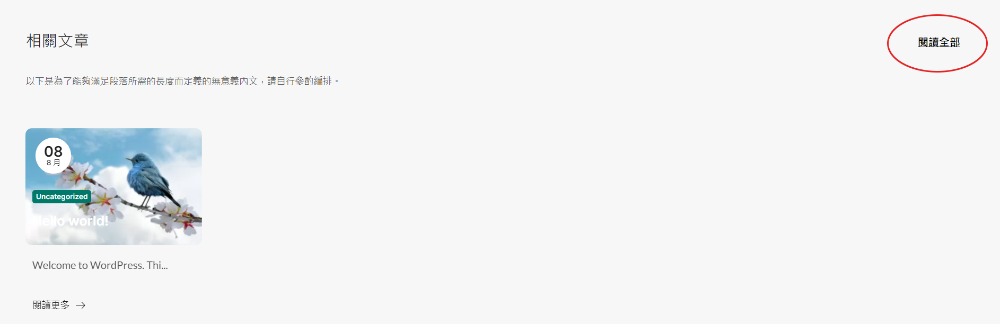
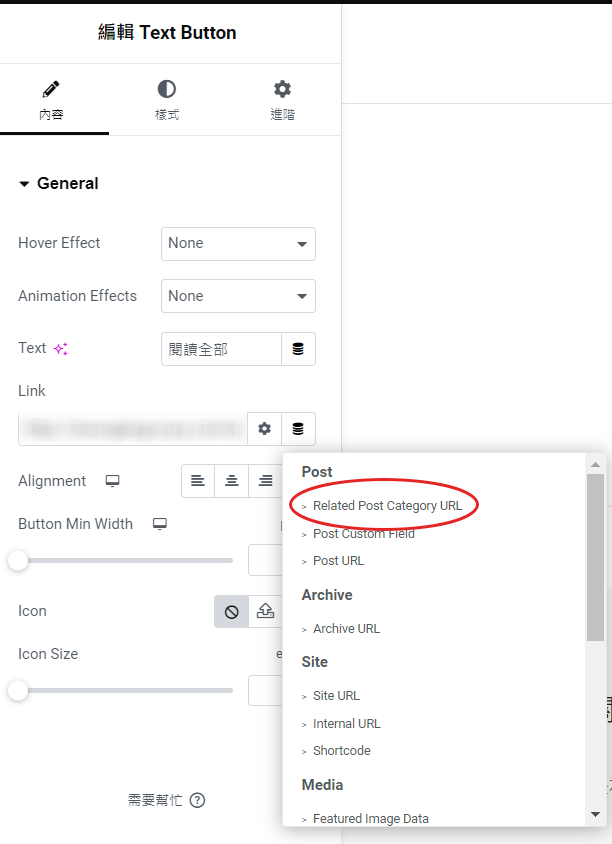

# WordPress Plugins

## Table of Contents
- [Plugin 1 : Dynamic Tag - Post Category URL](#plugin-1-dynamic-tag---post-category-url)
- [Plugin 2 : Woo Custom Shipping Zones](#plugin-2-woo-custom-shipping-zones)

---

## Plugin 1 : Dynamic Tag - Post Category URL
A simple Elementor dynamic tag plugin that allows you to display the URL of the first category of a WordPress post.

### Description
The **Dynamic Tag - Post Category URL** plugin integrates seamlessly with Elementor, allowing users to retrieve and display the URL of the first category assigned to a post. This dynamic tag is particularly useful for linking to related categories in a visually appealing way.

### Features
- **Dynamic Tag**: Adds a new dynamic tag to Elementor: **"Related Post Category URL"**.
- **URL Output**: Outputs the URL of the first category of the current post.
- **Easy Integration**: Simple to use with Elementor's dynamic content options.

### Installation
1. Upload the `post_category_dynamic_tag` folder to the `/wp-content/plugins/` directory.
2. Activate the plugin through the 'Plugins' menu in WordPress.
3. Use the **"Related Post Category URL"** tag in your Elementor designs.

### Usage
- In Elementor, when editing a post or template, insert the **"Related Post Category URL"** dynamic tag in any widget that supports dynamic content.
- This will output the URL of the first category associated with the post.

### Image Reference

### Frequently Asked Questions

**Q: What does this plugin do?**  
A: This plugin adds a dynamic tag to Elementor that outputs the URL of the first category of a post.

**Q: How do I use the dynamic tag?**  
A: After activating the plugin, find the **"Related Post Category URL"** tag in Elementor's dynamic content options.

**Q: Is this plugin compatible with all themes?**  
A: The plugin is designed to work with any WordPress theme that supports Elementor.

---
## Plugin 2 : Woo Custom Shipping Zones
A simple WordPress plugin that customizes shipping zones in WooCommerce for specific regions in Hong Kong.

### Description
The **Custom Woo Shipping Zones** plugin allows you to define specific shipping zones for different areas in Hong Kong. This is particularly useful for businesses operating in Hong Kong who want to offer tailored shipping options based on the customer's location.

### Features
- Adds custom shipping zones for various districts in Hong Kong.
- Easy to customize and extend if needed.
- Compatible with WooCommerce.

### Installation
1. Download the plugin files.
2. Upload the plugin folder to your WordPress installation's `/wp-content/plugins/` directory.
3. Activate the plugin through the 'Plugins' menu in WordPress.
4. The custom shipping zones will be available in the WooCommerce settings.

### Usage
After activating the plugin, you can configure your shipping zones by navigating to:
1. WooCommerce > Settings.
2. Click on the 'Shipping' tab.
3. You will see the custom zones listed under the 'Shipping Zones' section.

### Image Reference
Default_Zones

Plugin_Zones

